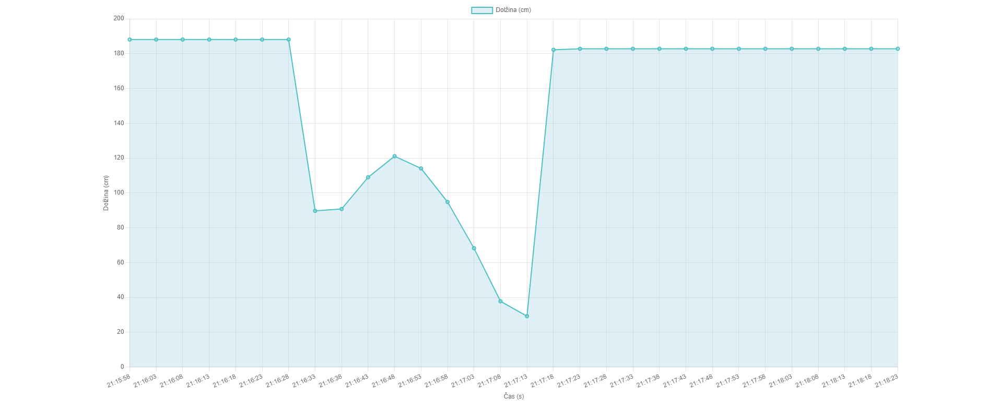

# Water Level Sensor Using Arduino D1 and Ultrasonic Sensor (HC-SR04)

This project demonstrates how to build a water level meter using an ultrasonic sensor (HC-SR04) connected to an Arduino D1 (ESP8266). The water level data is captured and displayed in real-time on a web-based interface, along with graphical visualization (using Chart.js) of the last 2 minutes and half of measurements, updated every 5 seconds. Additionally, the IP address of the device is printed on the serial monitor for easy access to the web server.

## Features

- Real-time monitoring: Continuously measures water level using an ultrasonic sensor.
- Web-based visualization: Displays the last 2 minutes and half of water level readings on a website, updating every 5 seconds.
- Responsive chart: Graphically displays measurements on the web interface using Chart.js.
- Serial Monitor Output: Displays the device's IP address on the serial monitor upon startup.

## Components

- Arduino D1 (ESP8266)
- Ultrasonic Sensor (HC-SR04)
- Jumper Wires
- Breadboard (optional for easier connections)

## Setup and Connections
|Component (HC-SR04)|Arduino D1 |
|-|-|
|VCC|5V|
|GND|GND|
|Trig|D4|
|Echo|D3|

## Schematic Diagram

Below is the wiring schematic of the water level meter system.

# Example Output

### Serial Monitor

When the system starts, the Arduino D1 will connect to the Wi-Fi network, and the IP address of the web server will be printed in the serial monitor as follows:

### Web Interface

The following is an example of the graphical interface displayed on the web page, which shows the real-time water level measurements.

## How to Use

1. **Install ESP8266 Library**: Ensure you have the ESP8266 module library installed in your Arduino IDE.
2. **Connect the Hardware**: Set up the ultrasonic sensor according to the schematic provided.
3. **Upload the Code**: Flash the Arduino D1 with the provided code.
4. **Monitor the Serial**: Open the serial monitor to get the IP address of the device.
5. **Access the Web Interface**: Type the IP address shown in the serial monitor into your web browser to view real-time water level measurements and graph.
